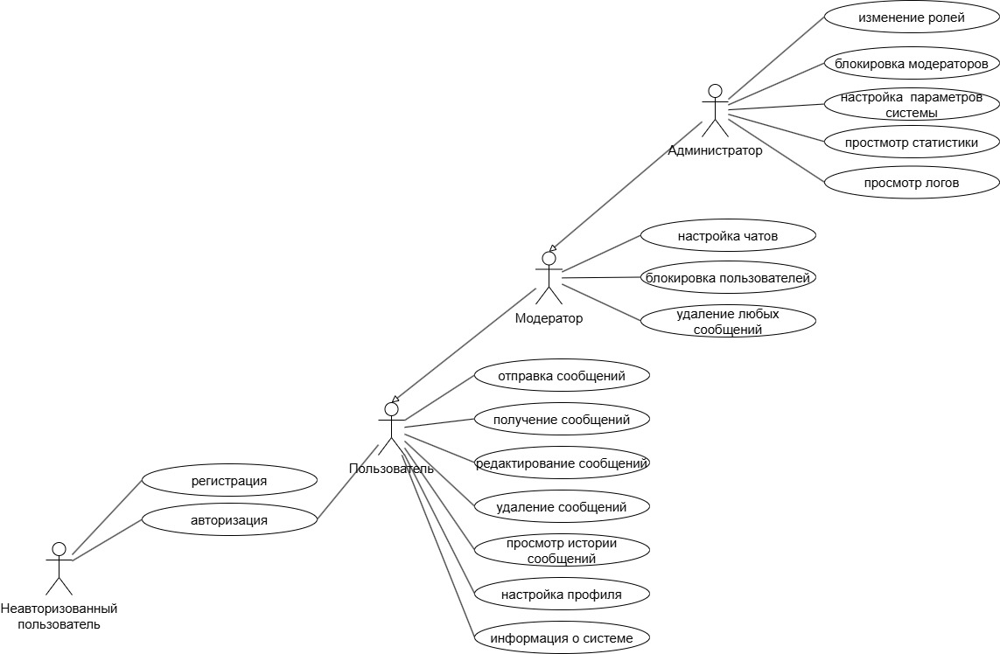
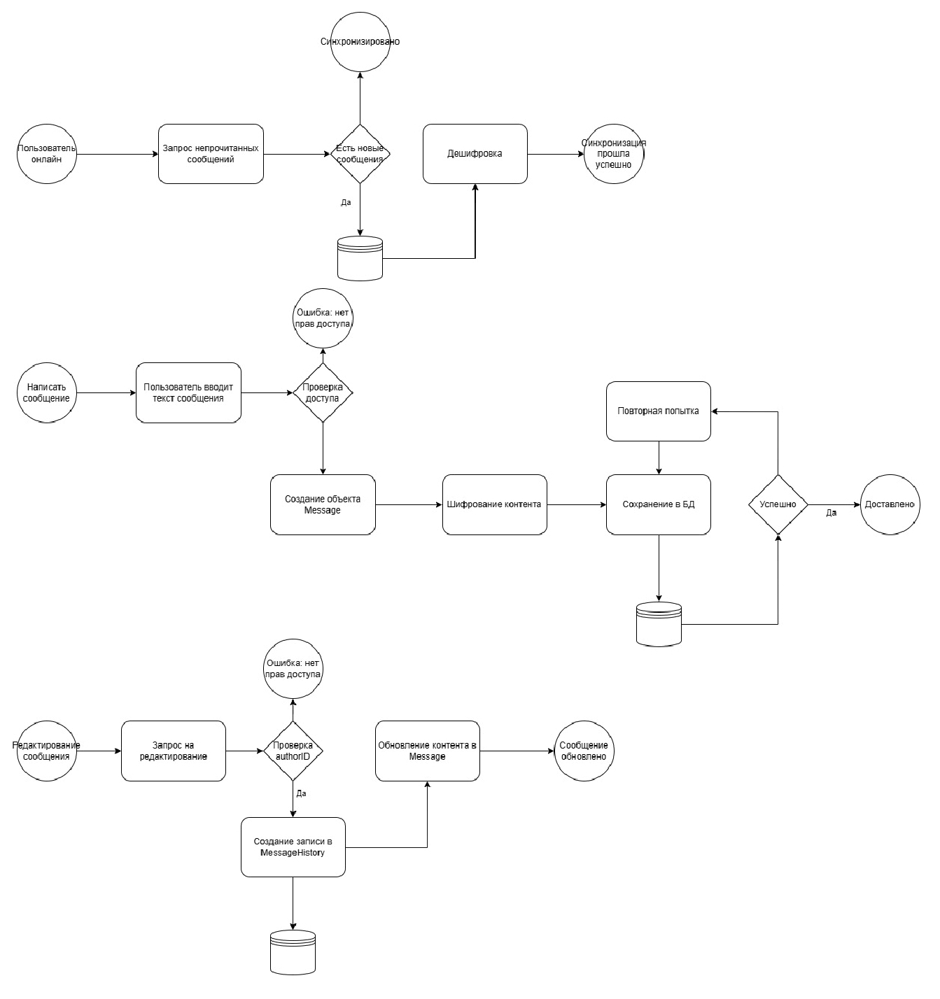
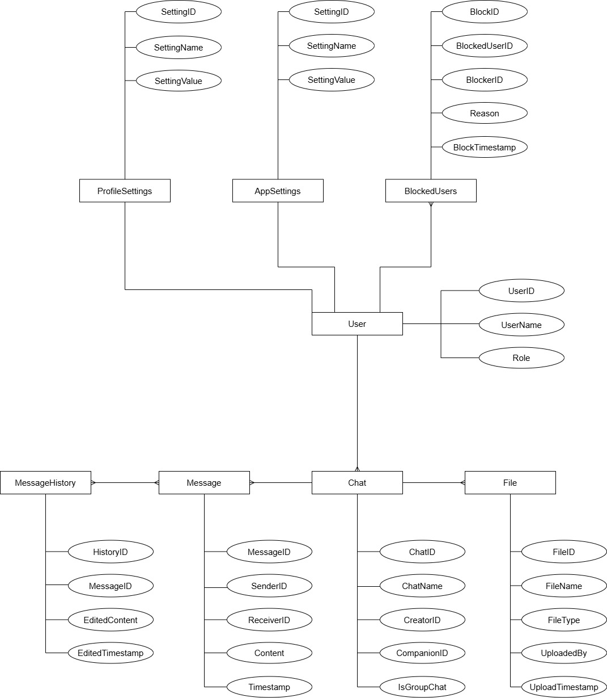
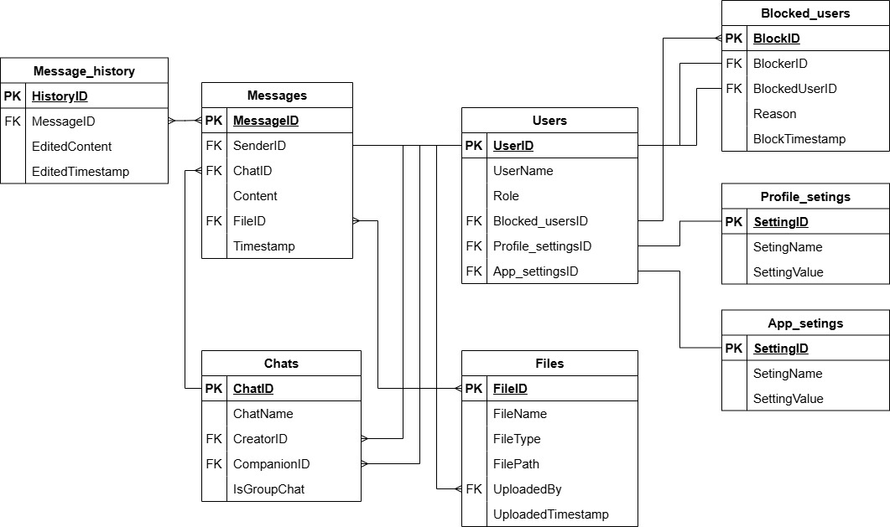
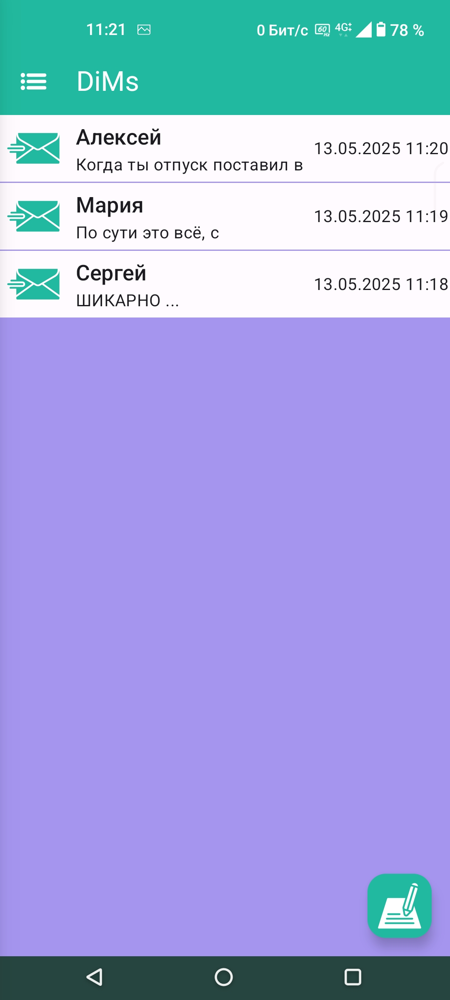
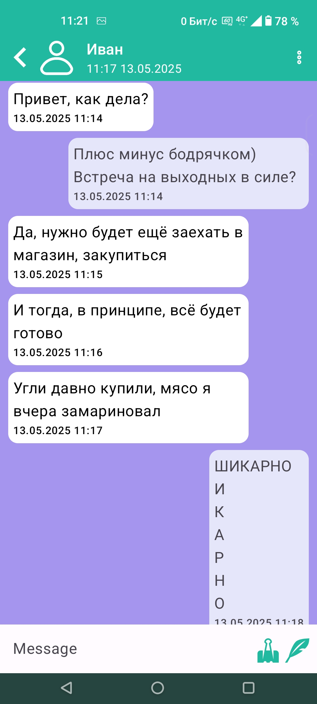
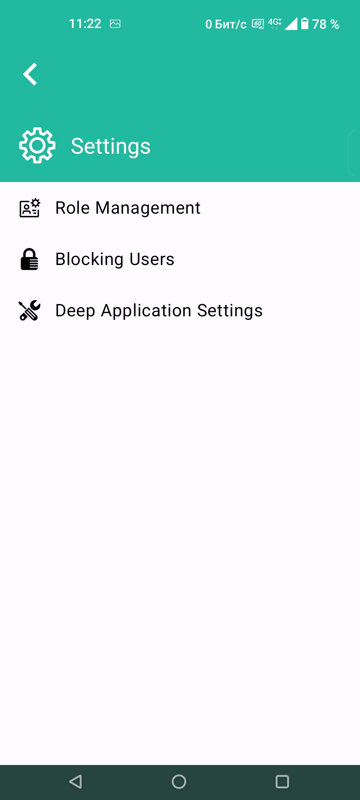
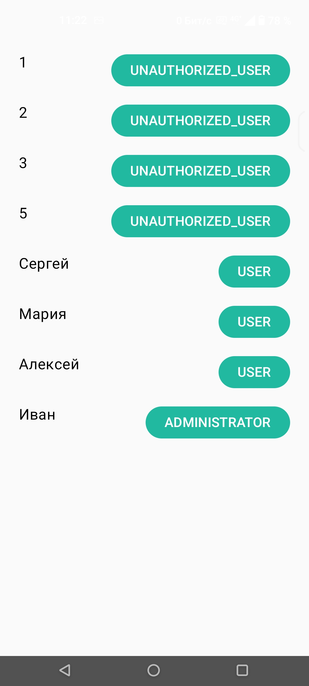
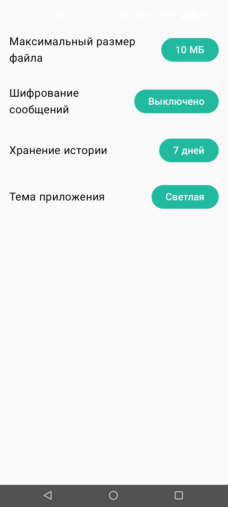

# IU7_WEB

### 1. Цель работы, решаемая проблема/предоставляемая возможность

**Цель работы:** Спроектировать архитектуру и пользовательские интерфейсы для децентрализованного web-приложения для обмена сообщениями.

**Решаемая проблема:** Современные мессенджеры зависят от централизованных серверов, что создает единую точку отказа. В случае сбоя сервера или его блокировки пользователи теряют возможность коммуникации. Кроме того, хранение данных на центральном сервере вызывает опасения относительно конфиденциальности переписки.

**Предоставляемая возможность:** Проектируемое приложение решает эту проблему путем использования P2P (peer-to-peer) архитектуры. Каждый клиент является одновременно и узлом сети, что обеспечивает высокую отказоустойчивость и безопасность. Система позволит пользователям обмениваться сообщениями напрямую, без посредников, гарантируя конфиденциальность за счет сквозного шифрования.

### 2. Краткий перечень функциональных требований

*   пользователи должны иметь возможность отправлять текстовые
сообщения, а также мультимедиа (изображения, видео, файлы);
*   сообщения должны доставляться в реальном времени с минимальными
задержками;
доставкой при восстановлении соединения;
*   пользователи должны иметь возможность редактировать или удалять
отправленные сообщения;
*   система должна поддерживать версионирование сообщений, сохраняя
историю изменений;
*   регистрация и аутентификация пользователей без привязки к личным
данным;
*   управление профилями пользователей (изменение имени, статуса).

### 3. Use-case диаграмма системы

### 4. BPMN диаграмма основных бизнес-процессов
*   синхронизация;
*   отправка сообщения;
*   редактирование сообщения.

### 5. Примеры описания основных пользовательских сценариев

#### Сценарий 1: Отправка сообщения в групповом чате
*   **Действующее лицо:** Пользователь (авторизованный).
*   **Предусловие:** Пользователь открыл приложение и находится в окне личного чата.
*   **Ход выполнения:**
    1.  Пользователь вводит текст сообщения в поле ввода.
    2.  Пользователь нажимает кнопку "Отправить".
    3.  Система шифрует сообщение с использованием ключей, доступных участникам чата.
    4.  Сообщение отправляется по P2P-сети всем активным участникам чата.
    5.  Сообщение отображается в интерфейсе чата у отправителя и сохраняется в его локальной базе данных.
    6.  Собеседник получает и дешифрует сообщение, которое появляется в их интерфейсе.

#### Сценарий 2: Регистрация нового пользователя
*   **Действующее лицо:** Неавторизованный пользователь.
*   **Предусловие:** Пользователь находится на стартовой странице приложения.
*   **Ход выполнения:**
    1.  Пользователь нажимает на кнопку "Регистрация".
    2.  Система отображает форму для ввода логина и пароля.
    3.  Пользователь заполняет поля и подтверждает ввод.
    4.  Система проверяет, что логин уникален.
    5.  Система создает учетную запись и сохраняет ее
    6.  Пользователь автоматически авторизуется и попадает на главный экран со списком чатов.

#### Сценарий 3: Модератор удаляет сообщение
*   **Действующее лицо:** Модератор.
*   **Предусловие:** Модератор находится в чате, где у него есть соответствующие права.
*   **Ход выполнения:**
    1.  Модератор видит сообщение, нарушающее правила чата.
    2.  Модератор вызывает контекстное меню сообщения и выбирает пункт "Удалить для всех".
    3.  Система запрашивает подтверждение действия.
    4.  После подтверждения система отправляет всем участникам чата команду на удаление данного сообщения.
    5.  Сообщение пропадает из истории у всех пользователей.

#### Сценарий 4: Блокировка другого пользователя
*   **Действующее лицо:** Пользователь (авторизованный).
*   **Предусловие:** Пользователь находится в общем чате с другим участником, которого он хочет заблокировать.
*   **Ход выполнения:**
    1.  Пользователь нажимает на имя или аватар другого участника, чтобы открыть его профиль или контекстное меню.
    2.  В появившемся меню он выбирает опцию "Заблокировать".
    3.  Система запрашивает подтверждение действия.
    4.  После подтверждения система добавляет ID заблокированного пользователя в локальную таблицу UserBlock.
    5.  С этого момента клиентское приложение пользователя перестает принимать и отображать сообщения от заблокированного ID.
    6.  В интерфейсе заблокированного пользователя появляется опция "Разблокировать".

#### Сценарий 5: Просмотр истории изменений сообщения
*   **Действующее лицо:** Пользователь (авторизованный).
*   **Предусловие:** Пользователь находится в чате и видит сообщение с пометкой "изменено".
*   **Ход выполнения:**
    1.  Пользователь нажимает на сообщение выбирает в контекстном меню сообщения опцию "Показать историю".
    2.  Система делает запрос к локальной базе данных, чтобы найти все записи в таблице MessageHistory, связанные с MessageID данного сообщения.
    3.  Система отображает всплывающее окно, в котором в хронологическом порядке показаны все предыдущие версии текста сообщения с указанием времени каждого изменения.
    4.  Пользователь может закрыть это окно и вернуться к просмотру чата.

### 6. ER-диаграмма сущностей

### 7. Технологический стек

**Язык:** **Kotlin**

**Фреймворк:** **Spring**

**База данных:** **PostgreSQL**

**Контейнеризация:** **Docker**

**Ключевые API и библиотеки:**
*    **WebRTC API**  для организации P2P-соединений
*    **Firebase SDK** для взаимодействия с Realtime Database

**Сервис:** **Google Firebase**
*    **Firebase Realtime Database:** Используется в качестве "виртуального" сигнального сервера. Клиенты подписываются на определенные "комнаты" (пути) в базе данных. Когда один клиент хочет установить соединение, он записывает свои данные для подключения (SDP offer) в эту комнату. Другой клиент, слушая изменения, считывает эти данные, генерирует свой ответ (SDP answer) и записывает его обратно. Таким образом, база данных выступает посредником для обмена сигнальными сообщениями.

**Инфраструктура для P2P:**
*   **Публичные STUN-серверы:** необходимы для определения внешних IP-адресов клиентов, чтобы они могли найти друг друга в сети.

### 8. Диаграмма БД

### 9. Компонентная диаграмма системы

### 10. Экраны будущего web-приложения (Wireframes)

| Список чатов | Личный чат | Админ панель |
| :---: | :---: | :---: |
|  |  |  |

| Настройки | Управление ролями | Системные настройки |
| :---: | :---: | :---: |
|  |  |  |