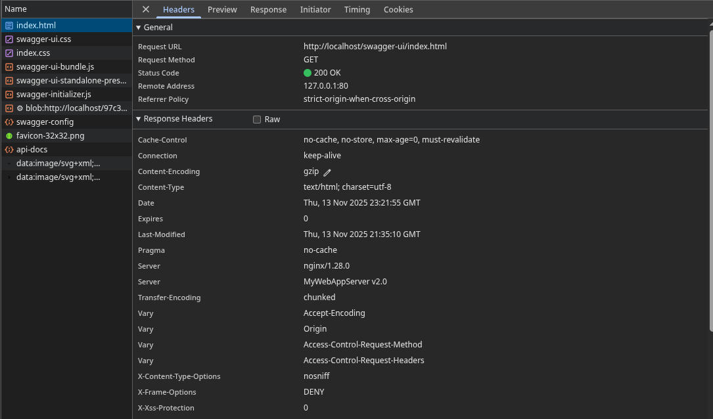
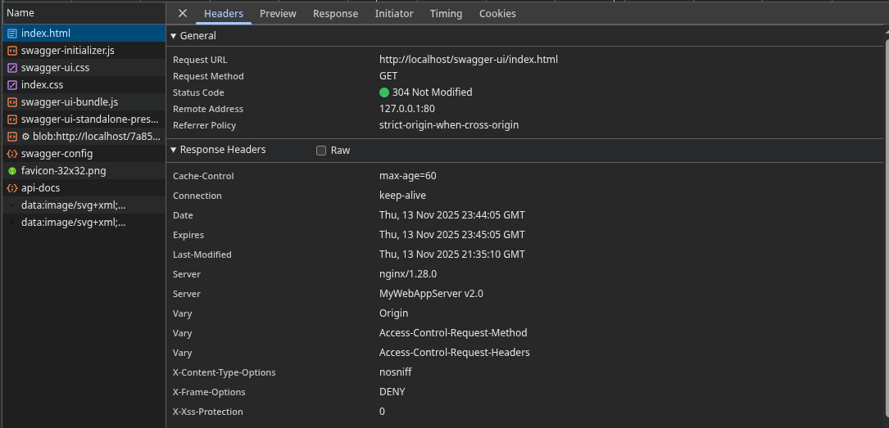
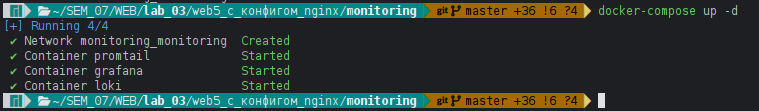
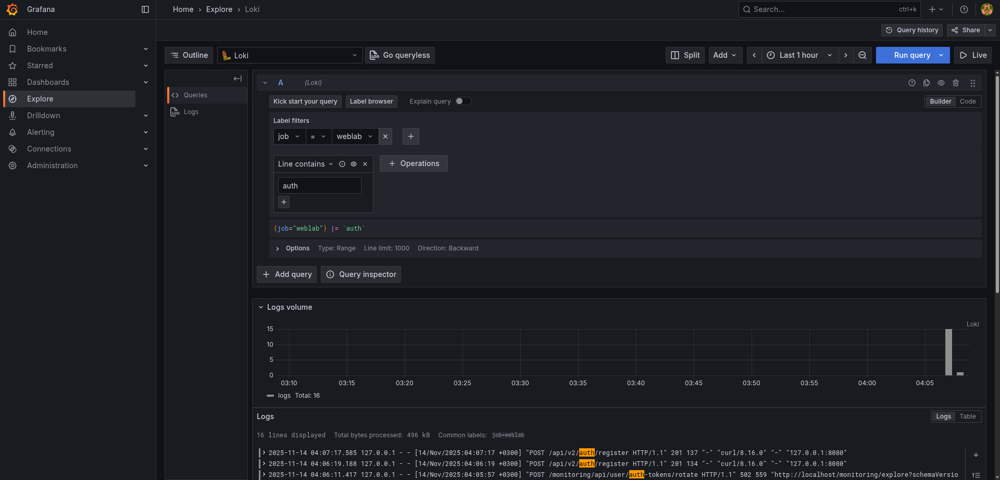

## 1. Настройка балансировки

### 1.a. Запуск инстансов

Для симуляции распределенной системы были запущены три экземпляра бэкенд-приложения на разных портах (запуск `./web5.sh`):
- **Master (Read/Write):** `127.0.0.1:8080`
- **Replica 1 (Read-Only):** `127.0.0.1:9091`
- **Replica 2 (Read-Only):** `127.0.0.1:9092`


### 1.b. Балансировка GET-запросов (2:1:1)
```nginx
upstream spring_boot_replicas {
    server 127.0.0.1:8080 weight=2;
    server 127.0.0.1:9091;
    server 127.0.0.1:9092;
}
```

### 1.c. Перенаправление запросов на запись
Запросы на запись (POST, PUT, PATCH, DELETE) направляются строго на master-инстанс (8080)


```nginx
upstream spring_boot_master {
    server 127.0.0.1:8080;
}

location /api/v2/ {
    if ($request_method ~ ^(POST|PUT|PATCH|DELETE)$) {
        proxy_pass http://spring_boot_master;
    }
}
```

### 1.d. Обработка ошибок записи на репликах

Если read-only реплика вернет ошибку `405 Method Not Allowed`, NGINX перенаправит запрос на master-инстанс для выполнения.

```nginx
location @handle_write_error {
    proxy_pass http://spring_boot_master;
}

location /api/v2/ {
    proxy_intercept_errors on;
    error_page 405 = @handle_write_error;
}
```

---

## 2. Нагрузочное тестирование

Тестирование проводилось с помощью утилиты Apache Benchmark.

### Тест 1: Балансировка GET-запросов

**Команда:**
```bash
ab -n 100 -c 10 http://localhost/api/v2/users
```

**Результаты `ab`:**
```
Server Software:        nginx/1.28.0
Server Hostname:        localhost
Server Port:            80

Document Path:          /api/v2/users
Document Length:        0 bytes

Concurrency Level:      10
Time taken for tests:   0.414 seconds
Complete requests:      100
Failed requests:        0
Non-2xx responses:      100
Total transferred:      28400 bytes
HTML transferred:       0 bytes
Requests per second:    241.48 [#/sec] (mean)
Time per request:       41.412 [ms] (mean)
Time per request:       4.141 [ms] (mean, across all concurrent requests)
Transfer rate:          66.97 [Kbytes/sec] received

Connection Times (ms)
              min  mean[+/-sd] median   max
Connect:        0    0   0.4      0       3
Processing:     5   29  47.4     10     186
Waiting:        5   29  47.5     10     186
Total:          5   30  47.4     10     187

Percentage of the requests served within a certain time (ms)
  50%     10
  66%     18
  75%     22
  80%     26
  90%    137
  95%    172
  98%    186
  99%    187
 100%    187 (longest request)
```

**Соотношение при работе балансировки (по фрагменту `access.log`):**
Распределение запросов по инстансам (порт: количество запросов):
- **:8080**: ~58
- **:9091**: ~23
- **:9092**: ~19

```log
127.0.0.1 - - [14/Nov/2025:00:59:24 +0300] "GET /api/v2/users HTTP/1.0" 403 0 "-" "ApacheBench/2.3" "-" "127.0.0.1:9091"
127.0.0.1 - - [14/Nov/2025:00:59:24 +0300] "GET /api/v2/users HTTP/1.0" 403 0 "-" "ApacheBench/2.3" "-" "127.0.0.1:8080"
127.0.0.1 - - [14/Nov/2025:00:59:24 +0300] "GET /api/v2/users HTTP/1.0" 403 0 "-" "ApacheBench/2.3" "-" "127.0.0.1:8080"
127.0.0.1 - - [14/Nov/2025:00:59:24 +0300] "GET /api/v2/users HTTP/1.0" 403 0 "-" "ApacheBench/2.3" "-" "127.0.0.1:8080"
127.0.0.1 - - [14/Nov/2025:00:59:24 +0300] "GET /api/v2/users HTTP/1.0" 403 0 "-" "ApacheBench/2.3" "-" "127.0.0.1:9092"
...
```

### Тест 2: Разделение запросов на запись

**Строки из `access.log` для POST-запросов:**
```log
127.0.0.1 - - [14/Nov/2025:01:01:09 +0300] "POST /api/v2/auth/register HTTP/1.1" 201 145 "-" "curl/8.16.0" "-" "127.0.0.1:8080"
127.0.0.1 - - [14/Nov/2025:01:01:21 +0300] "POST /api/v2/auth/register HTTP/1.1" 403 0 "-" "curl/8.16.0" "-" "127.0.0.1:8080"
127.0.0.1 - - [14/Nov/2025:01:01:25 +0300] "POST /api/v2/auth/register HTTP/1.1" 403 0 "-" "curl/8.16.0" "-" "127.0.0.1:8080"
127.0.0.1 - - [14/Nov/2025:01:01:35 +0300] "POST /api/v2/auth/register HTTP/1.1" 201 134 "-" "curl/8.16.0" "-" "127.0.0.1:8080"
```
POST-запросы строго на `master` инстанс (`:8080`)

---

## 3. Маршрутизация на `/mirror`

Настроено проксирование всех запросов с префиксом `/mirror/` на отдельную версию приложения (симулируется тем же `master` инстансом).

```nginx
location /mirror/ {
    proxy_pass http://spring_boot_master/;
    proxy_redirect default; 
}
```
При переходе на http://localhost/mirror/swagger-ui/index.html открывается полнофункциональный Swagger, все URL-адреса которого работают через префикс `/mirror`.

---

## 4. Подмена заголовков сервера

Имя сервера в HTTP-ответах изменено на `MyWebAppServer v2.0`.

```nginx
add_header Server "MyWebAppServer v2.0";
```
Скриншот из инструментов разработчика



## 5. Кеширование и Gzip-сжатие

- **Gzip-сжатие** включено для всех основных текстовых типов контента, включая ответы API.
- **Браузерное кеширование** настроено для всех статических ресурсов (HTML, CSS, изображения) на 1 день.

```nginx
gzip on;
gzip_types text/plain text/css application/json application/javascript text/xml application/xml application/xml+rss text/javascript;

location / {
    try_files $uri $uri/ =404;
    expires 1d;
}
```
Скриншот из инструментов разработчика, где для статического ресурса заголовок `Content-Encoding: gzip`, а при повторной загрузке — статус `304 Not Modified`.




---

## 6. Мониторинг

Для визуализации логов со всех инстансов приложения была развернута связка Grafana + Loki + Promtail с помощью Docker.

- **Loki** выступает в роли хранилища логов.
- **Promtail** настроен как агент, который отслеживает файлы `*.log` в корневой директории проекта и отправляет их в Loki.
- **Grafana** используется для визуализации. Источник данных Loki был добавлен автоматически через provisioning.

```nginx
location /monitoring/ {
     proxy_pass http://127.0.0.1:3000/;
}
```
Для мониторинга:

1. `./web5.sh`

2. 

3. ```sh
    $ curl -X POST http://localhost/api/v2/auth/register \
    -H "Content-Type: application/json" \
    -d '{"username": "user333", "password": "password"}'
    
    {"id":"4fbc1f2d-d5f1-4251-8be2-fef30548f7a9","username":"user333","role":"USER","profileSettingsId":null,"appSettingsId":null}
    ```

И в **Grafana** (l:admin, p:admin) будет доступен мониторинг



**Grafana** доступна по http://localhost/monitoring/
